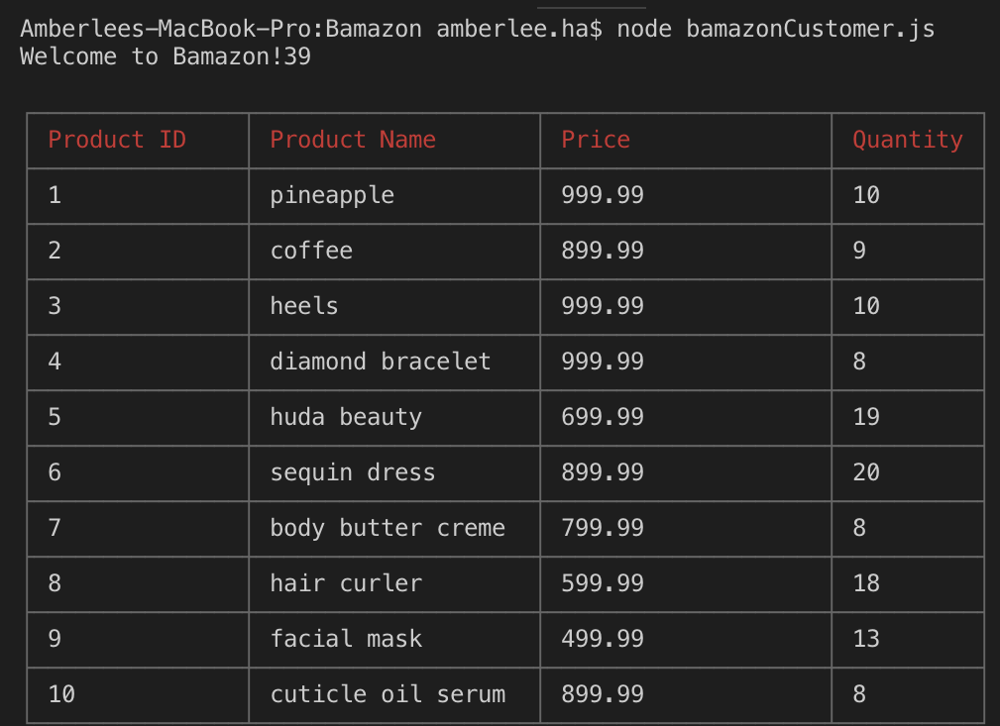
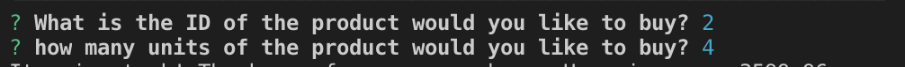
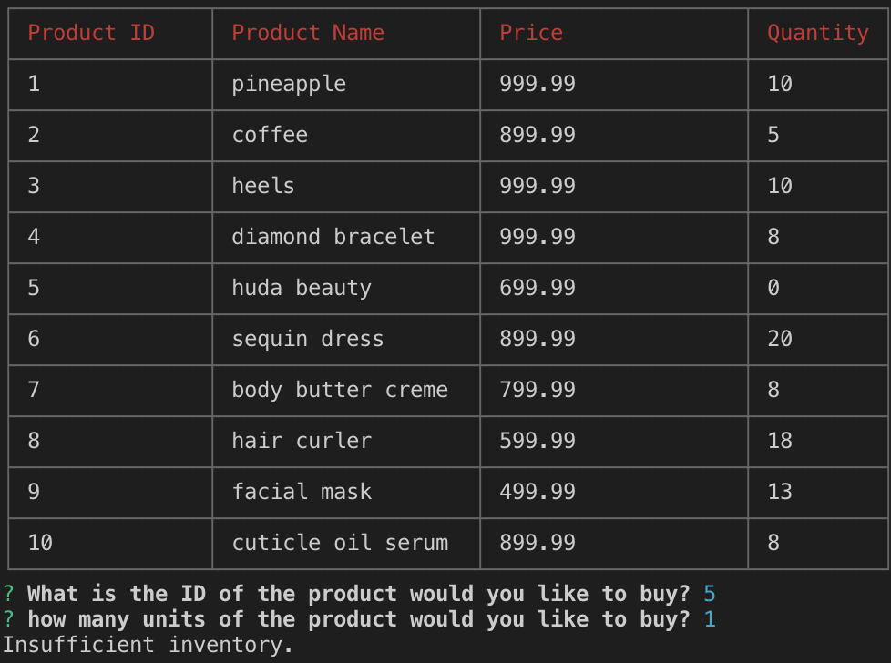
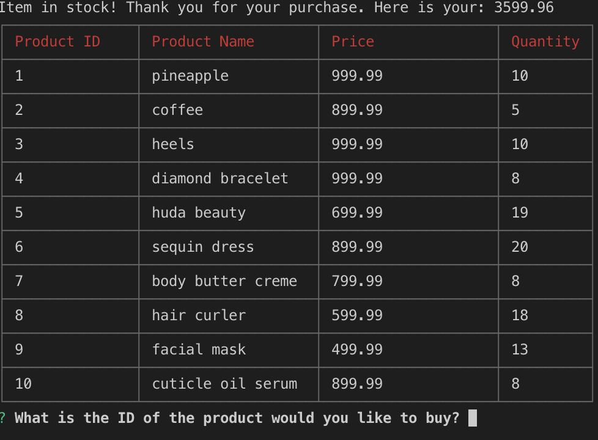

# Bamazon

Running this application will first display all of the items available for sale. Include the ids, names, and prices of products for sale.

The app will then prompt users with two messages.

-The first will ask for the ID of the product they would like to buy.
-The second message will ask how many units of the product you would like to buy.

Once the customer has placed the order, your application should check if your store has enough of the product to meet the customer's request.

-If not, the app should log a 'Insufficient inventory', and then prevent the order from going through.

If our store does have enough of the product, the order will be fulfilled the customer's order.
 

-This means updating the SQL database to reflect the remaining quantity.
-Once the update goes through, show the customer the total cost of their purchase.
